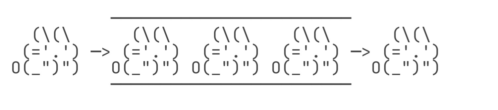
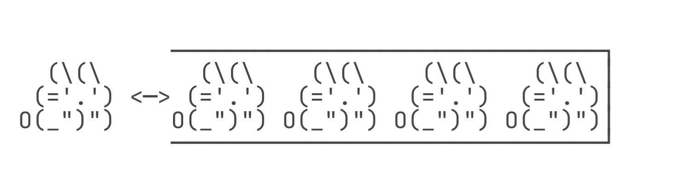

# Java Stack

栈（Stack）是一种后进先出（LIFO：Last In First Out）的数据结构。

什么是LIFO呢？我们先回顾一下Queue的特点FIFO：

所谓FIFO，是最先进队列的元素一定最早出队列，而LIFO是最后进Stack的元素一定最早出Stack。如何做到这一点呢？只需要把队列的一端封死：

因此，Stack是这样一种数据结构：只能不断地往Stack中压入（push）元素，最后进去的必须最早弹出（pop）来：

Stack只有入栈和出栈的操作：

+ 把元素压栈：push(E)；
+ 把栈顶的元素“弹出”：pop()；
+ 取栈顶元素但不弹出：peek()。

在Java中，我们用Deque可以实现Stack的功能：

+ 把元素压栈：push(E)/addFirst(E)；
+ 把栈顶的元素“弹出”：pop()/removeFirst()；
+ 取栈顶元素但不弹出：peek()/peekFirst()。

为什么Java的集合类没有单独的Stack接口呢？因为有个遗留类名字就叫Stack，出于兼容性考虑，所以没办法创建Stack接口，只能用Deque接口来“模拟”一个Stack了。

当我们把Deque作为Stack使用时，注意只调用push()/pop()/peek()方法，不要调用addFirst()/removeFirst()/peekFirst()方法，这样代码更加清晰。